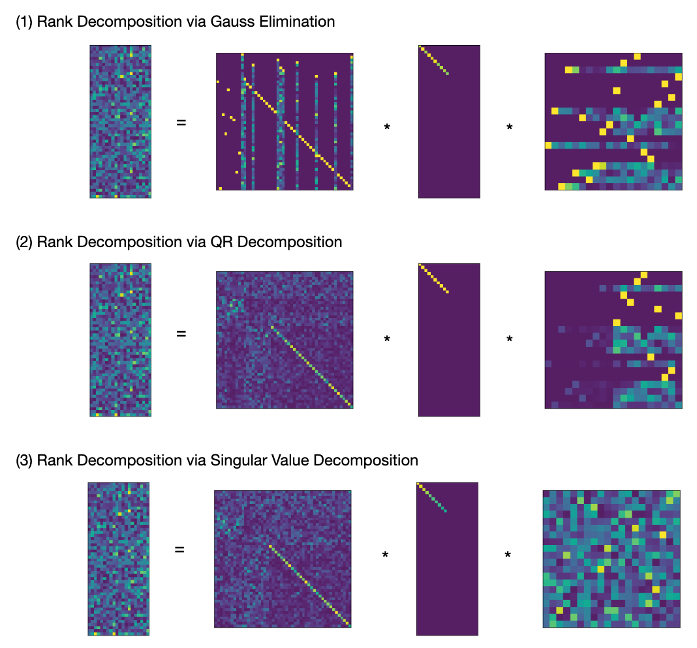

$$
  
  \newcommand{\id}{\mathbb{1}}
  \newcommand{\oo}{\mathbb{0}}
  \newcommand{\iff}{\;\Leftrightarrow\;}
$$

The rank decomposition of a $m \times n$ Matrix is an fundamental result in Linear Algebra, that
tells us that "up to choice of bases all linear maps are equivalent to a simple diagonal
matrix". This result is of great value for both theoretical development and practical computations
in linear algebra. When performing calculations by hand, the rank decomposition is commonly derived
using Gauss Elimination.  Curiously, treatments of Numerical Linear Algebra do not use or mention
this result, but focus on Matrix Factorizations (LU, QR, Cholesky, etc.) instead, which use the same
methods, look very similar but do not quite yield a rank factorization.

In this note we are going to study the rank decomposition from the theoretical and practical
perspective.  We give a short proof of the abstract result, and sketch a number of applications. We
continue to explain how to derive a rank decomposition using three different numeric methods:

1. Gauss Elimination in the form of LDU Factorization with total pivoting
2. Rank-Revealing QR-Factorization with column pivoting
3. Singular Value Decomposition (SVD)

We provide implementations of all three methods in the Python/numpy ecosystem as part of a small
library [libla](https://github.com/HeinrichHartmann/libla) that is available on GitHub.
The effectiveness of the implementations is compared in terms of performance and accuracy.

## Abstract Rank Decomposition

{}
**Proposition (Rank Decomposition).** For every matrix $m \times n$ matrix $A \in M(m,n)$ over a field,
there exists invertible matrices $X \in M(n), Y\in M(m)$ so that

$$
    A = Y * \id^{r}_{m,n} * X,
   \qtext{where}
   \id^{r}\_{m,n} =
    \begin{bmatrix}
    \id_r & 0   \\\\
    0 & \oo\_{m-r,n-r} \\\\
    \end{bmatrix} =
   \begin{bmatrix}
    1 &         &   &           &         &   &    \\\\
      & \ddots &   &           &         &   &   \\\\
      &         & 1 &           &         &   &   \\\\
      &         &   & 0         & \dots  &  0&  \\\\
      &         &   & \vdots   &         & \vdots &  \\\\
      &         &   & 0         & \dots  & 0 &  \\\\
    \end{bmatrix}.
$$
Here $\id^{r}\_{m,n}$ is the $m \times n$ matrix with $r$-diagonal entries $1$ 
and remaining entries $0$.

The number $r$ is uniquely determined by $A$ and is called the **rank** of $A$.
{}

{}
I was not able to find a proof of this well known classification result on Wikipddia, so we give a
short proof here.  The proof given here is not constructive, but as we will see below there are a
number of ways to construct the those transformations $X,Y$ algorithmically.

Let $c_1,\dots,c_r$ be a basis of $Im(A)$.
Choose pre-images $b_i$ of $c_i$. The vectors $b_i$ are linearly independent, since they
map to linearly independent vectors under $A$. Furthermore $b_i$ do not lie in $Ker(A)$,
since $c_i = A*b_i$ are non-zero. By the
[dimension formula](https://en.wikipedia.org/wiki/Linear_map#Kernel,_image_and_the_rank%E2%80%93nullity_theorem),
$dim(Ker(A)) = m-r$ and we can complete $b_i$ to a basis of $\IR^n$ with
vectors from $Ker(A)$. Complete $c_i$ to a basis of $\IR^m$ in an arbitrary way.
Then $A b_i =c_i$ for $i\leq r$ and $A b_i = 0$ for $i > r$.
Let $X$ be the matrix with columns $b_i$, and $Y$ the inverse of the matrix with columns $c_i$.
Then $Y A X e_i = Y A b_i = Y c_i = e_i$ for $i \leq r$ and $Y A X e_i = 0$ otherwise.
QED.
{}

Once such a representation is established, many linear algebra constructions become trivial.
Using the transformations $X,X^{-1},Y,Y^{-1}$ we can translate problems between $A$ and 
$\id^{r}\_{n,m}$
back and forth. Since $\id^{r}_{n,m}$ is a diagonal matrix, most questions are readily solvable:

1. Solving Linear Systems. The following equations are equivalent:
   $$
   A x = b \iff \id^{r}\_{m,n} x' = b' \iff
   \begin{Bmatrix}
   x'[i] = b'[i] & i\leq r \\\\
       0 = b'[i] & i > r
   \end{Bmatrix}
   $$
   where $x'=X^{-1} x$ and $b'=Y b$.
2. The image of $A$ is spanned by the first r columns of $Y^{-1}$.
3. The kernel of $A$ is spanned by the last $n-r$ columns of $X$.
4. A complement of $Im(A)$ is spanned by the last $m-r$ columns of $Y^{-1}$.
5. A complement of $Ker(A)$ is spanned by the first $r$ columns of $X$.
6. A projection operator to $Im(A)$ is given by $Y^{-1} \id^r_m Y$.
7. A projection operator to $Ker(A)$ is given by $X (\id_n - \id^r_n) X^{-1}$.

This list of applications should convince the reader that such a decomposition is of high practical value.

## Rank Decomposition Algorithms

The principal difficulty that we face when numerically computing a rank decomposition is numeric
stability. As a small perturbation of any matrix has full rank, we must be careful not to
mis-interpret "accidental" linear independence, and allow for some "slack" when deriving the rank.

It turns out, that there is a significant amount of literature that is devoted to stable numeric
algorithms to determine the rank of a matrix. Keywords to search are "Rank Revealing" matrix
factorization, "rank deficit problems". The most thorough treatment that I am aware of is:

* Hansen -- Rank Deficit and Discrete Ill Posed Problems (Numerical Aspects of Linear Inversion) (SIAM, 1998).

In this note, we will visit the following three approaches:

1. Gauss Elimination in the form of "Rank Revealing" LDU Factorization with total pivoting
2. Rank-Revealing QR-Factorization with column pivoting
3. Singular Value Decomposition (SVD)

### 1. Rank Decomposition via Gauss Elimination (RRLU)

The [Gauss Elimination Algorithm](https://en.wikipedia.org/wiki/Gaussian_elimination) can be used to
construct a rank decomposition.

{}
**Theorem (Rank-Revealing LDU factorization with total pivoting, RRLU)**
For every matrix $A \in M(m,n)$, we will construct

1. a (row) permutation matrix $P \in M(m)$
1. a (column) permutation matrix $Q \in M(n)$
2. an invertible lower-triangular matrix $L \in M(m)$ with unit diagonal
3. an invertible upper-triangular matrix $U \in M(n)$ with unit diagonal
4. an invertible diagonal matrix $D_r \in M(r,r)$

so that:

$$
A = P * L * D * U * Q,
\qtext{where}
D = \begin{bmatrix}
D_r & 0   \\\\
0 & \oo\_{m-r,n-r} \\\\
\end{bmatrix}.
$$
{}

**Corollary**
Given $P,Q,L,D_r,U$ as above, a rank decomposition is given by $Y = (P L)^{-1}$, $X = Q U^{-1} (D_r \vsum \id)^{-1}$.

**Elimination Matrix.** Gauss Elimination makes use of eleminiation matrices, that geometrically
correspond to [shear transformations](https://en.wikipedia.org/wiki/Shear_mapping):  For vectors
$a,b$ with $(a,a)=1$ and $(a,b) = 0$, we consider the $E_{a,b}: x \mapsto x + (a,x) b$. This is map
defines a linear isomorphism with inverse $E_{a,-b}$.  In case $a = e_r$ and $b[r]=1$ we call
$E_{a,b}$ the elimination matrix $E^r_b$.

{}
We only give a sketch here. More details can be found e.g. in [Trefeten, Bau -- Numerical Linear Algebra, Lecture 20.](http://people.maths.ox.ac.uk/~trefethen/text.html)

We proceed recursively. If either $m = 0$ or $n = 0$ we are done.

Select any non-zero element $p = A[i,j]$ as so called pivot element, and apply permutation
matrices $P,Q$, so that $p = PAQ[1,1]$.

Eliminate the first column using an elimination matrix $E^1_b$ acting on the left.
Eliminate the first row using a transposed elimination matrix $E^{1t}_c$ acting on the right.

The reduced matrix has block-diagonal form $A = p \vsum B$.  Recursively we can assume that we have
a factorization for $B$ that can be easily be extended to a factorization of the reduced $A$.  To
arrive at a factorization of the original matrix from here, we exploit the fact that that for an
elimination matrix $E$ and a permutation matrix $P$, we have $E P = P' E'$ for another elimination
matrix $E'$ and permutation matrix $P'$.

QED.

{}

### 2. Rank Decomposition via QR-Factorization (RRQR)

We call an upper triangular matrix row-reduced, if ...

{}
**Theorem (Rank-Revealing QR factorization, RRQR)**
For every matrix $A \in M(m,n)$ there is

1. a (column) permutation matrix $P \in M(n)$
1. an orthogonal matrix $Q \in M(m)$
3. an invertible upper-triangular matrix $R_0 \in M(r, r)$
4. a matrix $R_1 \in M(m-r, n)$

so that:

$$
A = Q * R * P,
\qtext{where}
R = \begin{bmatrix}
R_0 & R_1   \\\\
\oo\_{m-r,n} & \oo\_{m-r,n-r} \\\\
\end{bmatrix}
$$
{}

**Corollary:**
Get rank decomposition via $X = Q^t$, $Y = P^t R_{0}^{-1} \vsum \id_{n-r}$.

**Remark:**

There are three different constructions, which are all numerically effective
and geometrically interesting:

1. Gram Schmidt Process
2. Householder Reflections
3. Givens Rotation

...

### 3. Rank Decomposition via Singular Value Decomposition (SVD)

{}
**Proposition (Singular Value Decomposition)**
For every matrix $X \in M(m,n)$ with entries in the real numbers $\IR$,
there are orthogonal matrices $U \in M(n), V \in M(m)$ so that

$$
A = U * \Sigma * V
$$
Where $\Sigma \in M(m,n)$ is a matrix with diagonal entries $\sigma_1 \geq \sigma_2, \dots, \sigma_r > 0$
and $\sigma_i = 0$ for $i > r$, $r = rk(A)$ and entries $0$ outside of the diagonal.
{}

This result is proved by studying the images of the $n$-dimensional unit-sphere under the linear
defined by $A$, and applying the real-analytical [Lagrange Multiplier
Criterion](https://en.wikipedia.org/wiki/Lagrange_multiplier) criterion. See
[wikipedia](https://en.wikipedia.org/wiki/Singular_value_decomposition).

Given matrices $U,\Sigma,V$ as above, we obtain a rank-decomposition as $X = U^t, Y = V^t D$, 
where $D$ is a diagonal $m \times m$ matrix with diagonal entries $\sigma^{-1}_i, i<r$ and $1$ else.

A numeric calculation of the SVD is not trivial and makes use of iterative methods and Eigenvalue
calculations.  The necessity of these complications is plausible, since in addition to a rank
decomposition, the SVD also calculates the eigenvalues of $A A^t$ and $A^t A$. Hence any SVD
algorithm yields also an Eigenvalue algorithm for a symmetric positive semi-definite matrices S
(after Cholesky Factorization).

Numeric experiments show that SVD is a factor of 2-3 more expensive to compute than QR factorization.

## A Counter Example

Consider a block-matrix $A \in M(2n,2n)$ of the form

$$
A = \begin{bmatrix}
0 & B \\\\
0 & 0 \\\\
\end{bmatrix}.
$$

with $B \in M(n)$. We have $rk(A) = rk(B)$. So depending on $R$ this matrix may have any rank
between in $0$ and $n$. However, $A$ is also upper-triangular and can hence be trivially factorized
as:

* LU Factorization: $L = \id_n, U = A$.
* QR Factorization: $Q = \id_n, R = A$.

This example shows, that:

* LU and QR factorization can not be used directly to compute a rank decomposition
* The rank of a triangular matrix is *NOT* determined by it's diagonal entries

## Implementations

Example implementations based on Python/numpy of all three variants are provided as part of the new
[libla](https://github.com/HeinrichHartmann/libla/) library on GitHub:

* via Gauss Elimination https://github.com/HeinrichHartmann/libla/blob/0.0.1/main.py#L299
* via QR Decomposition https://github.com/HeinrichHartmann/libla/blob/0.0.1/main.py#L374
* via SVD https://github.com/HeinrichHartmann/libla/blob/0.0.1/main.py#L406

### Example

The following illustration shows plots (python/matplotlib/imshow) of the rank decomposition
of a random $20 \times 50$ matrix of rank 10.

### Performance

Since LDU factorization with total pivot search is not implemented in Fortran Library LAPACK, it is
also not available a function in numpy, hence we had to roll our own Gauss Elimination algorithm in
pure python. This implementation is very slow and not competitive with the other two variants.

The performance of QR- and SVD-based Rank Decomposition are compared in this graph:



In this experiment we computed the Rank Decomposition of randomized $n \times n$ matrices of rank $n/2$.

From this example it can be seen, that the implemented SVD and QR methods perform nearly identical.
The raw QR factorization is a factor of 2-3 faster than SVD on my machine, so there is a
considerable amount of overhead caused by post-processing steps necessary for in the QR variant,
that leave potential for optimization.

# Conclusion

It turns out that determining the most fundamental invariant of a matrix: it's rank, is a
numerically challenging problem, that can not be directly derived from the basic matrix
factorization algorithms (LU, QR) in their common form. Instead we have to either resort to
strengthened variants or to the more advanced SVD decomposition.

Of the three studied methods RRQR and SVD give practical ways to calculate a rank decomposition in
the Python/numpy/LAPACK ecosystem. As the performance difference is minimal, and the SVD variant is
more powerful and convenient to use, the SVD variant is to be recommended for practical purposes at
this point in time.

From the theoretical perspective, RRLDU factorization would be an effective method, that is faster
and simple and well suited for practical applications. Since the numpy/LAPAC does not come with a
limited LU implementation that is not "rank revealing" we don't have a competitive implementation
available.
