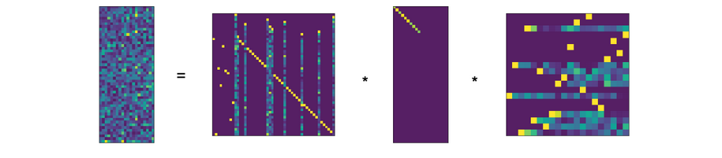

$$
  
  \newcommand{\id}{\mathbb{1}}
  \newcommand{\oo}{\mathbb{0}}
  \newcommand{\iff}{\;\Leftrightarrow\;}
$$

The rank decomposition of a $m \times n$ matrix $A$ is an fundamental result in Linear Algebra, that
tells us that "up to choice of bases $A$ is equivalent to a diagonal matrix with $rk(A)$ ones on the
diagonal". This result is of great value for both theoretical development and practical computations
in linear algebra. When performing calculations by hand, the rank decomposition is commonly derived
using Gauss Elimination.  Curiously, introductory treatments of Numerical Linear Algebra do not use
or mention this result, but focus on Matrix Factorizations (LU, QR, Cholesky, etc.) instead,
which use the same methods, look very similar but do not quite yield a rank decomposition.

In this note we are going to study the rank decomposition from the theoretical and practical
perspective.  We give a short proof of the abstract result, and sketch a number of applications. We
continue to explain how to derive a rank decomposition using three different numeric methods:

1. Gauss Elimination in the form of LDU Factorization with total pivoting
2. QR-Factorization with column pivoting
3. Singular Value Decomposition (SVD)

We provide implementations of all three methods in the Python/numpy ecosystem as part of a small
library [libla](https://github.com/HeinrichHartmann/libla) that is available on GitHub,
and compare their performance.

## Abstract Rank Decomposition

{}
**Proposition (Rank Decomposition).** For every matrix $m \times n$ matrix $A \in M(m,n)$ over a field,
there exists invertible matrices $X \in M(m), Y\in M(n)$ so that

$$
    A = X * D_r * Y,
   \qtext{where}
   D =
    \begin{bmatrix}
    \id_r & 0   \\\\
    0 & 0 \\\\
    \end{bmatrix}
$$
So $D$ is the $m \times n$ matrix with $r$-diagonal entries $1$ and remaining entries $0$.

The number $r$ is uniquely determined by $A$ and is called the **rank** of $A$.
{}

I was not able to find a proof of this well known classification result on Wikipddia, so we give a
short (non-constructive) proof here.

**Proof.**
Let $c_1,\dots,c_r$ be a basis of $Im(A)$.
Choose pre-images $b_i$ of $c_i$. The vectors $b_i$ are linearly independent, since they
map to linearly independent vectors under $A$. Furthermore $b_i$ do not lie in $Ker(A)$,
since $c_i = A*b_i$ are non-zero. By the
[dimension formula](https://en.wikipedia.org/wiki/Linear_map#Kernel,_image_and_the_rank%E2%80%93nullity_theorem),
$dim(Ker(A)) = m-r$ and we can complete $b_i$ to a basis of $\IR^n$ with
vectors from $Ker(A)$. Complete $c_i$ to a basis of $\IR^m$ in an arbitrary way.
Then $A b_i =c_i$ for $i\leq r$ and $A b_i = 0$ for $i > r$.
Let $Y$ be the inverse of the matrix with columns $b_i$, and $X$ the matrix with columns $c_i$.
Then $X D Y b_i = X D e_i = X e_i = c_i$ for $i \leq r$ and $X D Y b_i = 0$ otherwise.
QED.

**Applications**
Once such a representation is established, many linear algebra constructions become trivial.
Using the transformations $X,X^{-1},Y,Y^{-1}$ we can translate problems between $A$ and 
$D$
back and forth. Since $D$ is a diagonal matrix, most questions are readily solvable:

1. Solving Linear Systems. The following equations are equivalent:
   $$
   A x = b \iff D x' = b' \iff
   \begin{Bmatrix}
   x'[i] = b'[i] & i\leq r \\\\
       0 = b'[i] & i > r
   \end{Bmatrix}
   $$
   where $x'=Y x$ and $b'=X^{-1} b$.
2. The image of $A$ is spanned by the first r columns of $X$.
3. The kernel of $A$ is spanned by the last $n-r$ columns of $Y^{-1}$.
4. A complement of $Im(A)$ is spanned by the last $m-r$ columns of $X$.
5. A complement of $Ker(A)$ is spanned by the first $r$ columns of $Y^{-1}$.
6. A projection operator to $Im(A)$ is given by $X D X^{-1}$.
7. A projection operator to $Ker(A)$ is given by $Y^{-1} (\id_n - D) Y$.

This list of applications should convince the reader that such a decomposition is of high practical value.

## Rank Decomposition Algorithms

The principal difficulty that we face when numerically computing a rank decomposition is numeric
stability. As a small perturbation of any matrix has full rank, we must be careful not to
mis-interpret "accidental" linear independence, and allow for some "slack" when deriving the rank.

It turns out, that there is a significant amount of literature that is devoted to stable numeric
algorithms to determine the rank of a matrix. Keywords to search are "rank revealing" matrix
factorization, "rank deficit problems". Here are some pointers to the print literature:

* [Hansen1987] P. Hansen -- Rank-Deficient and Discrete Ill-Posed Problems (1987)  
  https://api.semanticscholar.org/CorpusID:122731599 https://dx.doi.org/10.1137/1.9780898719697

* [Golub1983] G. Golub -- Matrix computations (1983) / Chapter 5.4.2  
  https://api.semanticscholar.org/CorpusID:126299280 https://dx.doi.org/10.2307/3621013

In this note, we will visit the following three approaches that overcome these difficulties:

1. Gauss Elimination in the form of "Rank Revealing" LDU Factorization with total pivoting
2. Rank-Revealing QR-Factorization with column pivoting
3. Singular Value Decomposition (SVD)

### A counter example

In order to see, that the usual LU, QR, etc. algorithms are not sufficient to derive
a rank decomposition consider a block-matrix $A \in M(2n,2n)$ of the form

$$
A = \begin{bmatrix}
0 & B \\\\
0 & 0 \\\\
\end{bmatrix}.
$$
with $B \in M(n)$. This is a already upper triangular matrix, so the LU and QR factorizations are trivial.
Also note that the diagonal of $A$ has only zero entries, so we might be tempted to conclude that $rk(A) = 0$.
However, we clearly have $rk(A) = rk(B)$. So depending on $R$ this matrix may have any rank between in $0$ and $n$.

This example shows, that:

* LU and QR factorization can not be used directly to compute a rank decomposition
* The rank of a triangular matrix is *NOT* determined by it's diagonal entries

Instead, we need to consider "rank revealing" variants of those algorithms, that further reduce a matrix
that is already triangular.

### 1. Rank Decomposition via Gauss Elimination (LDU)

{}
**Theorem (LDU factorization with total pivoting)**
For every matrix $A \in M(m,n)$, we will construct

1. a (row) permutation matrix $P \in M(m)$
1. a (column) permutation matrix $Q \in M(n)$
2. an invertible lower-triangular matrix $L \in M(m)$ with unit diagonal
3. an invertible upper-triangular matrix $U \in M(n)$ with unit diagonal
4. an invertible diagonal matrix $D_r \in M(r,r)$

so that:

$$
A = P * L * D * U * Q,
\qtext{where}
D = \begin{bmatrix}
D_r & 0   \\\\
0 & \oo\_{m-r,n-r} \\\\
\end{bmatrix}.
$$
{}

**Corollary**
Given $P,Q,L,D_r,U$ as above, a rank decomposition is given by $Y = (P L)^{-1}$, $X = Q U^{-1} (D_r \vsum \id)^{-1}$.

**Elimination Matrix.** Gauss Elimination makes use of eleminiation matrices, that geometrically
correspond to [shear transformations](https://en.wikipedia.org/wiki/Shear_mapping):  For vectors
$a,b$ with $(a,a)=1$ and $(a,b) = 0$, we consider the $E_{a,b}: x \mapsto x + (a,x) b$. This is map
defines a linear isomorphism with inverse $E_{a,-b}$.  In case $a = e_r$ and $b[r]=1$ we call
$E_{a,b}$ the elimination matrix $E^r_b$.

**Algorithm** We only give a sketch of the Algorithm here since the ideas are well known. More
details can be found e.g. in [Trefethen1997, Lecture 20]

1. We proceed recursively. If either $m = 0$ or $n = 0$ we are done.
2. Select the element $p = A[i,j]$ with largest absolute value as pivot element, and apply
   permutation matrices from left and right, so that $p = A[1,1]$ after permutation.
3. Terminate if the $|p|$ is too small e.g. $< 10^{-10}$, to ensure numeric stability.
3. Eliminate the first column using an elimination matrix $E^1_b$ acting on the left.
4. Eliminate the first row using a transposed elimination matrix $E^{1t}_c$ acting on the right.
5. The reduced matrix has block-diagonal form $A = p \vsum B$.  Recursively we can assume that we have
   a factorization for $B$ that can be easily be extended to a factorization of the reduced $A$. 
6. To arrive at a factorization of the original matrix from here, we exploit the fact that that for an
   elimination matrix $E$ and a permutation matrix $P$, we have $E P = P' E'$ for another elimination
   matrix $E'$ and permutation matrix $P'$.

FIN.

**Discussion** The described algorithm computes a rank decomposition under exact arithmetic and
straight forward and allows efficient implementation.

By choosing the largest element in the matrix as pivot, obvious error amplifications are avoided.
However, it turns out that even with this conservative approach numeric stability is not guaranteed.
An example of a numeric instability was published in [Peters Wilkinson1970].
A good summary of the situation can be found in the introduction of [Pan2000].
A pivoting strategy that is numerically stable was first constructed by [Chan1984] and [Hwang1992].

On the positive side it looks like the numeric instabilities of LDU with total pivot search are 
do only very rarely occur in practice:

> These conditions also showthat matrices which are nearly singular but which the commonly used
> pivotingstrategies do not produce a small un „ all have a very special pattern to their
> inversesand their smallest singular vectors. Moreover, simple permutations of these matrices will
> produce small pivots with the usual pivoting strategies. Therefore, they are insome sense rare and
> relatively harmless. -- [Chan1984]

**Implementation**

Unfortunately LU factorization with total pivoting is not implemented in LAPAC, and hence not
available in python/numpy.  Similarly, I am not aware of an implementation of Rank-Revealing LU
factorization that can be effectively used from python.

**References**

* [Trefethen1997] L. Trefethen, David Bau -- Numerical Linear Algebra (1997)  
  https://api.semanticscholar.org/CorpusID:221907318 https://dx.doi.org/10.1201/9781315273693-7

* [Peters1970] G. Peters,  Wilkinson - The least-squares  problem  and  pseudo-inverses
  https://api.semanticscholar.org/CorpusID:44974854

* [Pan2000] Pan. On the existence and computation of rank-revealing LU factorizations
  https://api.semanticscholar.org/CorpusID:121188547

* [Hwang1992] Hwang, T., Lin, W., & Yang, E.K. (1992). Rank revealing LU factorizations.
  https://api.semanticscholar.org/CorpusID:122859959

* [Chan1984] Chan, T. (1984). On the existence and computation of $LU$-factorizations with small pivots
  https://api.semanticscholar.org/CorpusID:121539458

### 2. Rank Decomposition via QR-Factorization (QR)

{}
**Theorem (QR factorization with Column Pivoting, [Golub83,5.4.2])**
For every matrix $A \in M(m,n)$ there is

1. a (column) permutation matrix $P \in M(n)$
1. an orthogonal matrix $Q \in M(m)$
3. an invertible upper-triangular matrix $R_{11} \in M(r, r)$
4. a matrix $R_{12} \in M(m-r, n)$

so that:

$$
A = Q * R * P,
\qtext{where}
R = \begin{bmatrix}
R_{11} & R_{12}   \\\\
       0 & 0 \\\\
\end{bmatrix}
$$
{}

**Corollary:**
Get rank decomposition via $X = Q^t$, $Y = P^t * R = 
\begin{bmatrix}
  R_{11}^{-1} & -R_{11}^{-1} R_{12}   \\\\
            0 & \id_{n-r} \\\\
\end{bmatrix}
$.

**Householder Reflections** Similar to the "shear" transformations used in Gauss Elimination, QR
Decomposition can be constructed using simple rank-1 modifications to the identity matrix.  For a
vector $a \in \IR^n$ with $(a,a) = 1$ the map $R_a(x) = x - 2(x,a)a$ reflects a vector $x$ at the
hyperplane $a^{\perp}$. Householders [Householder1958] observation was, that for any given vector
$v$ it is rather easy to construct a reflection $a$ so that $R_a(v)$ is a multiple of $e_1$. The
corresponding reflection matrix is called Householder matrix $H^1_v$, and has the property that
$H^1_v(v) = |v| e_1$.

**Algorithm**

The construction is similar to the Gauss Elimination process described above.
We again give a sketch of the construction, for more details see [Golub1983, Chapter 5].

1. We proceed recursively. If $n=0$ or $m=0$ we are done.
2. Identify a column $v = A[:,i]$ with maximal norm $|v|^2 = (v, v)$.
   Use a permutation $P$ matrix to bring $a$ to the front (so $v = (AP)[:,1]$ has maximal norm).
3. If $|a|^2$ is too small, terminate the process.
4. Use a Householder reflection to transform $v$ into a multiple of $e_1$.
   The matrix $H_v^1$ is orthogonal, and the transformed column vector $w = H_v^1AP[:,1]$ has
   only a single entry $w[1] = |v|$.
5. The reduced matrix has block-diagonal form $p \vsum B$.  Recursively we can assume that we have
   a factorization for $B = Q' R' P'$. This factorization can be easily extended to $p \vsum B$.
6. The factorization of the original matrix is obtained by composition $A = H^t Q' R' P' P^t$.

FIN.

**Remark:**
The geometry behind the QR decomposition is quite beautiful. There are three different
constructions, which are all numerically effective and geometrically interesting:

1. Householder Reflections (described above)
2. Givens Rotations
3. Gram Schmidt Orthogonalization Process

While 1,2 pursue the strategy of "orthogonal triangularization", method 3 proceeds in the reverse
direction of "triangular orthogonalization". I only learned while writing this blog, that the
straight forward Gram-Schmidt orthogonalization process is indeed a "reverse-gear QR factorization".

**Discussion** The described algorithm computes a rank decomposition under exact arithmetic and
straight forward and allows efficient implementation.

By choosing the largest column for elimination, we avoid the most obvious cases of error
amplification are avoided.  Again, it turns out that there are cases, where numeric instabilities
lead to cases where the residual matrices do not get small once the rank is exhausted.  The most
famous example is the "Kahn" matrix presented in [Lawson1998, p.31].

[Chan1987] demonstrated, that it is possible modify the algorithm to select columns that avoid those
numeric instabilities, and give a true "rank revealing QR decomposition".

On the positive side it looks like the numeric instabilities do only very rarely occur in practice:

> Nevertheless, in practice, small trailing R-suhmatrices almost always emerge that correlate well
> with the underlying rank. In other words, it is almost always the case that R_k is small if A has
> rank k. [Golub1983, p.279]

**Implementation**

Unfortunately QR factorization with column pivoting is implemented in LAPAC, and available in python/numpy.
I am not aware of an implementation of Rank-Revealing QR factorization that can be effectively used from python.

**References**

* [Householder1958] A. Householder -- Unitary Triangularization of a Nonsymmetric Matrix (1958)  
  https://api.semanticscholar.org/CorpusID:9858625 https://dx.doi.org/10.1145/320941.320947

* [Golub1983] G. Golub -- Matrix computations (1983)  
  https://api.semanticscholar.org/CorpusID:126299280 https://dx.doi.org/10.2307/3621013

* [Lawson1995] C. Lawson, R. Hanson -- Solving least squares problems (1995)  
  https://api.semanticscholar.org/CorpusID:122862057 https://dx.doi.org/10.1137/1.9781611971217

* [Chan1987] T. Chan -- Rank revealing QR factorizations (1987)  
  https://api.semanticscholar.org/CorpusID:119431073 https://dx.doi.org/10.1016/0024-3795(87)90103-0

### 3. Rank Decomposition via Singular Value Decomposition (SVD)

{}
**Proposition (Singular Value Decomposition)**
For every matrix $X \in M(m,n)$ with entries in the real numbers $\IR$,
there are orthogonal matrices $U \in M(n), V \in M(m)$ so that

$$
A = U * \Sigma * V
$$
Where $\Sigma \in M(m,n)$ is a matrix with diagonal entries $\sigma_1 \geq \sigma_2, \dots, \sigma_r > 0$
and $\sigma_i = 0$ for $i > r$, $r = rk(A)$ and entries $0$ outside of the diagonal.
{}

This result is proved by studying the images of the $n$-dimensional unit-sphere under the linear
defined by $A$, and applying the real-analytical [Lagrange Multiplier
Criterion](https://en.wikipedia.org/wiki/Lagrange_multiplier) criterion. See
[wikipedia](https://en.wikipedia.org/wiki/Singular_value_decomposition).

**Corollary** Given matrices $U,\Sigma,V$ as above, we obtain a rank-decomposition as $X = U^t, Y = V^t D$, 
where $D$ is a diagonal $m \times m$ matrix with diagonal entries $\sigma^{-1}_i, i<r$ and $1$ else.

A numeric calculation of the SVD is rather involved and makes use of iterative methods and
Eigenvalue calculations.  The necessity of these complications is plausible, since in addition to a
rank decomposition, the SVD also calculates the eigenvalues of $A A^t$ and $A^t A$.

**Implementation** SVD is implemented in LAPAC, and available in numpy/scipy.

**Discussion** The SVD of a matrix is a very powerful decomposition that yields a rank decomposition
and much more (orthogonal bases, eigenvalues of $A*A$). SVD implementations are numerically stable
readily available.

The price we have to pay for additional nice properties and guaranteed numeric stability is more
complicated algorithm (that I personally do not understand) that is less performant.

## Implementing Rank Decomposition in Python

Example implementations based on Python/numpy of all three variants are provided as part of the new
[libla](https://github.com/HeinrichHartmann/libla/) library on GitHub:

* via Gauss Elimination https://github.com/HeinrichHartmann/libla/blob/0.0.1/main.py#L299  

* via QR Decomposition https://github.com/HeinrichHartmann/libla/blob/0.0.1/main.py#L374

* via SVD https://github.com/HeinrichHartmann/libla/blob/0.0.1/main.py#L406

Since LDU factorization with total pivot search is not implemented in LAPACK/numpy, we roll our own
Gauss Elimination algorithm in pure python (SLOW!).

### Numeric Example

The following illustration shows plots (python/matplotlib/imshow) of the rank decomposition
of a random $20 \times 50$ matrix of rank 10.

### Performance

The performance of QR- and SVD-based Rank Decomposition are compared in this graph.
Our implementation Rank Decomposition with LU Factorization is an order of magnitude slower.



In this experiment we computed the Rank Decomposition of randomized $n \times n$ matrices of rank $n/2$.

From this example it can be seen, that the implemented SVD and QR methods perform nearly identical.
The raw QR factorization is a factor of 2-3 faster than SVD on my machine, so there is a
considerable amount of overhead caused by post-processing steps necessary for in the QR variant,
that leave potential for optimization.

# Conclusion

| Method | Complexity | Stability | Implementation |
|-|-|-|-|
| RD via LU Decomposition | $2n^3/3$ [Golub1983p.132]  | stable in practice  | not available in LAPAC |
| RD via QR Decomposition | $4mnr - 2 r^2 (m + n) + 4r^3/3$ [Golub1983, p.278] | stable in practice  | available |
| RD via SVD | $4m^2n + 8mn^2 + 9n^3$ [Golub1983,p.439] | proven to be stable | available|

It turns out that determining the most fundamental invariant of a matrix: it's rank, is a
numerically challenging problem, that can not be directly derived from the basic matrix
factorization algorithms (LU, QR) in their common form. Instead we have to either resort to
strengthened variants or to the more advanced SVD decomposition.

Of the three studied methods RRQR and SVD give practical ways to calculate a rank decomposition in
the Python/numpy/LAPACK ecosystem. As the performance difference is minimal, and the SVD variant is
more powerful and convenient to use, the SVD variant is to be recommended for practical purposes at
this point in time.

From the theoretical perspective, RRLDU factorization would be an effective method, that is faster
and simple and well suited for practical applications. Since the numpy/LAPAC does not come with a
limited LU implementation that is not "rank revealing" we don't have a competitive implementation
available.

# References

* [Golub1983] G. Golub -- Matrix computations (1983)  
  https://api.semanticscholar.org/CorpusID:126299280 https://dx.doi.org/10.2307/3621013

* [Hansen1987] P. Hansen -- Rank-Deficient and Discrete Ill-Posed Problems (1987)  
  https://api.semanticscholar.org/CorpusID:122731599 https://dx.doi.org/10.1137/1.9780898719697
