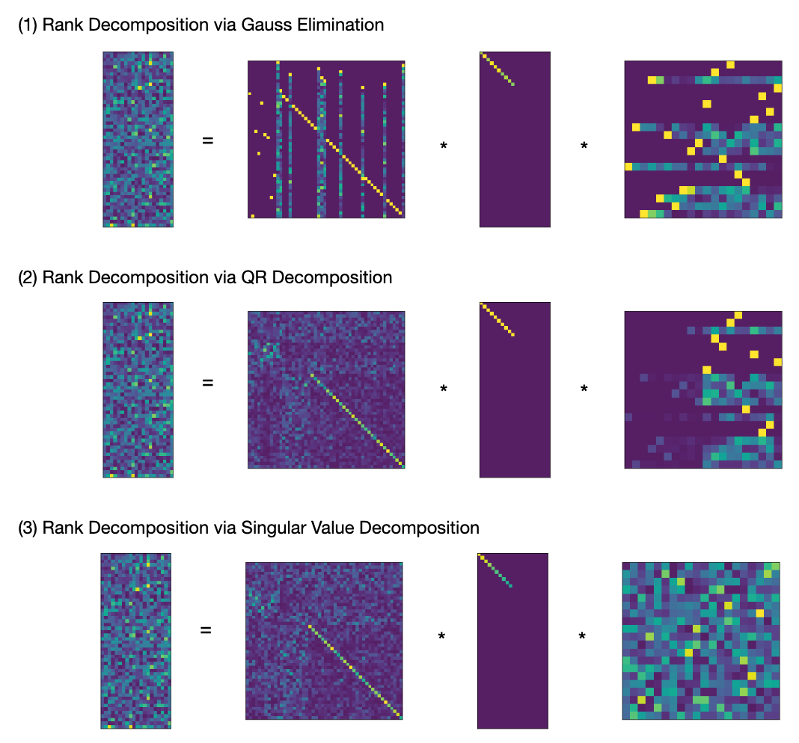
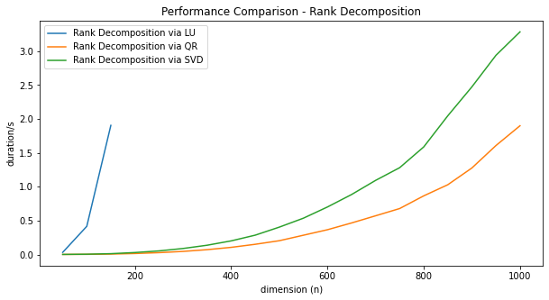

$$
  
  \newcommand{\id}{\mathbb{1}}
  \newcommand{\oo}{\mathbb{0}}
  \newcommand{\iff}{\;\Leftrightarrow\;}
$$

The rank decomposition of a $m \times n$ matrix $A$ is an fundamental result in Linear Algebra, that
tells us that "up to choice of bases $A$ is equivalent to a diagonal matrix with $rk(A)$ ones on the
diagonal". This result is of great value for both theoretical development and practical computations
in linear algebra. When performing calculations by hand, the rank decomposition is easily derived
using Gauss Elimination.  Curiously, introductory treatments of Numerical Linear Algebra that I am
aware of do not use or mention this result early on, but focus instead on Matrix Decompositions (LU,
QR, Cholesky, etc.), which use the same methods, look very similar but do not quite yield a rank
decomposition.

In this note we are going to study the rank decomposition from the theoretical and practical
perspective.  We give a short proof of the abstract result, and sketch a number of applications. 
We continue to explain how to derive a rank decomposition using three different numeric methods:

1. LU-Decomposition with total pivoting (Gauss Elimination)
2. QR-Decomposition with column pivoting
3. Singular Value Decomposition (SVD)

It turns out, that computing the rank of a matrix in a correct, stable and efficient way is a quite
subtle problem, that has a whole body of literature behind it. We provide implementations of all
three methods in the Python/NumPy ecosystem as part of a small library
[libla](https://github.com/HeinrichHartmann/libla) that is available on GitHub, and compare their
performance.

## Abstract Rank Decomposition

{}
**Proposition (Rank Decomposition).** For every matrix $m \times n$ matrix $A \in M(m,n)$ over a field,
there exists invertible matrices $X \in M(m), Y\in M(n)$ so that

$$
    A = X * D_r * Y,
   \qtext{where}
   D =
    \begin{bmatrix}
    \id_r & 0   \\\\
    0 & 0 \\\\
    \end{bmatrix}
$$
So $D$ is the $m \times n$ matrix with $r$-diagonal entries $1$ and remaining entries $0$.

The number $r$ is uniquely determined by $A$ and is called the **rank** of $A$.
{}

This result can be found in various forms in the literature, e.g. [Matrix
Equivalence](https://en.wikipedia.org/wiki/Matrix_equivalence), [Smith Normal Form](https://en.wikipedia.org/wiki/Smith_normal_form) on Wikipedia, [Gantmacher1961, Chapter 5]. I personally learned this from [Kowalsky1972, Theorem 16.1].

**Proof.**
Let $c_1,\dots,c_r$ be a basis of $Im(A)$.
Choose pre-images $b_i$ of $c_i$. The vectors $b_i$ are linearly independent, since they
map to linearly independent vectors under $A$. Furthermore $b_i$ do not lie in $Ker(A)$,
since $c_i = A*b_i$ are non-zero. By the
[dimension formula](https://en.wikipedia.org/wiki/Linear_map#Kernel,_image_and_the_rank%E2%80%93nullity_theorem),
$dim(Ker(A)) = m-r$ and we can complete $b_i$ to a basis of $\IR^n$ with
vectors from $Ker(A)$. Complete $c_i$ to a basis of $\IR^m$ in an arbitrary way.
Then $A b_i =c_i$ for $i\leq r$ and $A b_i = 0$ for $i > r$.
Let $Y$ be the inverse of the matrix with columns $b_i$, and $X$ the matrix with columns $c_i$.
Then $X D Y b_i = X D e_i = X e_i = c_i$ for $i \leq r$ and $X D Y b_i = 0$ otherwise.
QED.

**Applications.**
Once such a representation is established, many linear algebra constructions become trivial.
Using the transformations $X,X^{-1},Y,Y^{-1}$ we can translate problems between $A$ and 
$D$
back and forth. Since $D$ is a diagonal matrix, most questions are readily solvable:

1. Solving Linear Systems. The following equations are equivalent:
   $$
   A x = b \iff D x' = b' \iff
   \begin{Bmatrix}
   x'[i] = b'[i] & i\leq r \\\\
       0 = b'[i] & i > r
   \end{Bmatrix}
   $$
   where $x'=Y x$ and $b'=X^{-1} b$.
2. The image of $A$ is spanned by the first r columns of $X$.
3. The kernel of $A$ is spanned by the last $n-r$ columns of $Y^{-1}$.
4. A complement of $Im(A)$ is spanned by the last $m-r$ columns of $X$.
5. A complement of $Ker(A)$ is spanned by the first $r$ columns of $Y^{-1}$.
6. A projection operator to $Im(A)$ is given by $X D X^{-1}$.
7. A projection operator to $Ker(A)$ is given by $Y^{-1} (\id_n - D) Y$.

This list of applications should convince the reader that such a decomposition is of high practical value.

**References**

* [Kowalsky1972] H.‐J. Kowalsky, Lineare Algebra. Walter de Gruyter (1972)  
  [https://www.amazon.com/Lineare-Algebra-H-J-Kowalsky/dp/3110179636/ref=sr_1_1?dch...](https://www.amazon.com/Lineare-Algebra-H-J-Kowalsky/dp/3110179636/ref=sr_1_1?dchild=1&keywords=Kowalsky+Lineare+Algebra&qid=1615119813&s=books&sr=1-1)

* [Gantmacher1961] Gantmacher et.al -- The Theory of Matrices (1961)  
  https://api.semanticscholar.org/126123922 https://dx.doi.org/10.2307/3612823

## Rank Decomposition Algorithms

In order to see that the popular [LU-](https://en.wikipedia.org/wiki/LU_decomposition) and
[QR-Decomposition](https://en.wikipedia.org/wiki/QR_decomposition) methods are not sufficient to
derive a rank decomposition consider a block-matrix $A \in M(2n,2n)$ of the form

$$
A = \begin{bmatrix}
0 & B \\\\
0 & 0 \\\\
\end{bmatrix}.
$$

with $B \in M(n)$. This is a already upper triangular matrix, so the LU and QR decompositions are trivial.
Also note that the diagonal of $A$ has only zero entries, so we might be tempted to conclude that $rk(A) = 0$.
However, we clearly have $rk(A) = rk(B)$. So depending on $R$ this matrix may have any rank between in $0$ and $n$.

This example shows, that:

* The vanilla LU and QR decomposition methods can not be used directly to compute a rank decomposition
* The rank of a triangular matrix is *NOT* determined by it's diagonal entries

Instead, we need to consider "rank revealing" variants of those algorithms, that further reduce a
matrix that is already triangular. In this note, we will visit the following three approaches that
follow this approach:

1. LU-Decomposition with total pivoting (Gauss Elimination)
2. QR-Decomposition with column pivoting
3. Singular Value Decomposition (SVD)

### Numeric Instabilities

The principal difficulty that we face when numerically computing a rank decomposition are numeric
instabilities. As a small perturbation of any matrix has full rank, we must be careful not to
misinterpret "accidental" linear independence, and allow for some "slack" when deriving the rank.

It turns out, that there is a significant amount of literature that is devoted to stable numeric
algorithms to determine the rank of a matrix. Keywords to search are "rank revealing" matrix
decomposition, "rank deficit problems". Here are some pointers to the literature:

* [Hansen1987] P. Hansen -- Rank-Deficient and Discrete Ill-Posed Problems (1987)  
  https://api.semanticscholar.org/CorpusID:122731599 https://dx.doi.org/10.1137/1.9780898719697

* [Golub1983] G. Golub -- Matrix computations (1983) / Chapter 5.4.2  
  https://api.semanticscholar.org/CorpusID:126299280 https://dx.doi.org/10.2307/3621013

### 1. Rank Decomposition via LU Decomposition (Gauss Elimination)

{}
**Theorem (LDU decomposition with total pivoting)**
For every matrix $A \in M(m,n)$, we will construct

1. a (row) permutation matrix $P \in M(m)$
1. a (column) permutation matrix $Q \in M(n)$
2. an invertible lower-triangular matrix $L \in M(m)$ with unit diagonal
3. an invertible upper-triangular matrix $U \in M(n)$ with unit diagonal
4. an invertible diagonal matrix $D_r \in M(r,r)$

so that:

$$
A = P * L * D * U * Q,
\qtext{where}
D = \begin{bmatrix}
D_r & 0   \\\\
0 & \oo\_{m-r,n-r} \\\\
\end{bmatrix}.
$$
{}

**Corollary.**
Given $P,Q,L,D_r,U$ as above, a rank decomposition is given by $Y = (P L)^{-1}$, $X = Q U^{-1} (D_r \vsum \id)^{-1}$.

**Elimination Matrix.** Gauss Elimination makes use of elimination matrices, that geometrically
correspond to [shear transformations](https://en.wikipedia.org/wiki/Shear_mapping):  For vectors
$a,b$ with $(a,a)=1$ and $(a,b) = 0$, we consider the $E_{a,b}: x \mapsto x + (a,x) b$. This is map
defines a linear isomorphism with inverse $E_{a,-b}$.  In case $a = e_r$ and $b[r]=1$ we call
$E_{a,b}$ the elimination matrix $E^r_b$.

**Algorithm.** We only give a sketch of the Algorithm here since the ideas are well known. More
details can be found e.g. in [Trefethen1997, Lecture 20], [Golub1983, p.132],

1. We proceed recursively. If either $m = 0$ or $n = 0$ we are done.
2. Select the element $p = A[i,j]$ with largest absolute value as pivot element, and apply
   permutation matrices from left and right, so that $p = A[1,1]$ after permutation.
3. Terminate if the $|p|$ is too small e.g. $< 10^{-10}$, to ensure numeric stability.
3. Eliminate the first column using an elimination matrix $E^1_b$ acting on the left.
4. Eliminate the first row using a transposed elimination matrix $E^{1t}_c$ acting on the right.
5. The reduced matrix has block-diagonal form $A = p \vsum B$.  Recursively we can assume that we have
   a decomposition for $B$ that can be easily be extended to a decomposition of the reduced $A$. 
6. To arrive at a decomposition of the original matrix from here, we exploit the fact that that for an
   elimination matrix $E$ and a permutation matrix $P$, we have $E P = P' E'$ for another elimination
   matrix $E'$ and permutation matrix $P'$.

FIN.

**Complexity.** For a square matrix the presented algorithm requires $2/3 n^3 = 0.66 n^3$ floating
point operations [Golub1983, p.132].  The global search for a pivot element involves a significant
overhead of $O(n^3)$ comparisons.

**Discussion.** The described algorithm computes a rank decomposition under exact arithmetic and
straight forward and allows efficient implementation.

By choosing the largest element in the matrix as pivot, obvious error amplifications are avoided.
However, it turns out that even with this conservative approach numeric stability is not guaranteed.
An example of a numeric instability was published in [Peters Wilkinson1970].
A good summary of the situation can be found in the introduction of [Pan2000].
A pivoting strategy that is numerically stable was first constructed by [Chan1984] and [Hwang1992].

On the positive side it looks like the numeric instabilities of LDU with total pivot search are 
do only very rarely occur in practice:

> These conditions also show that matrices which are nearly singular but which the commonly used
> pivoting strategies do not produce a small [residual matrix] all have a very special pattern to their
> inversesand their smallest singular vectors. Moreover, simple permutations of these matrices will
> produce small pivots with the usual pivoting strategies. Therefore, they are insome sense rare and
> relatively harmless. -- [Chan1984]

**Implementation.**
Unfortunately LU decomposition with total pivoting is not implemented in LAPACK, and hence not
available in Python/NumPy.  Similarly, I am not aware of an implementation of Rank-Revealing LU
decomposition that can be effectively used from Python.

**References**

* [Peters1970] G. Peters,  Wilkinson - The least-squares  problem  and  pseudo-inverses (1970)  
  https://api.semanticscholar.org/CorpusID:44974854

* [Chan1984] Chan, T. (1984). On the existence and computation of $LU$-factorizations with small pivots (1984)  
  https://api.semanticscholar.org/CorpusID:121539458

* [Hwang1992] Hwang, T., Lin, W., & Yang, E.K. (1992). Rank revealing LU factorizations (1992)  
  https://api.semanticscholar.org/CorpusID:122859959

* [Pan2000] Pan. On the existence and computation of rank-revealing LU factorizations (2000)  
  https://api.semanticscholar.org/CorpusID:121188547

### 2. Rank Decomposition via QR-Decomposition (QR)

{}
**Theorem (QR decomposition with Column Pivoting, [Golub83,5.4.2])**
For every matrix $A \in M(m,n)$ there is

1. a (column) permutation matrix $P \in M(n)$
1. an orthogonal matrix $Q \in M(m)$
3. an invertible upper-triangular matrix $R_{11} \in M(r, r)$
4. a matrix $R_{12} \in M(m-r, n)$

so that:

$$
A = Q * R * P,
\qtext{where}
R = \begin{bmatrix}
R_{11} & R_{12}   \\\\
       0 & 0 \\\\
\end{bmatrix}
$$
{}

**Corollary:**
Get rank decomposition via $X = Q^t$, $Y = P^t * 
\begin{bmatrix}
  R_{11}^{-1} & -R_{11}^{-1} R_{12}   \\\\
            0 & \id_{n-r} \\\\
\end{bmatrix}$.
As $R_{11}$ is an upper-triangular matrix, the inverse can be computed with $O(n^2)$ operations using backward substitution.

**Householder Reflections.** Similar to the "shear" transformations used in Gauss Elimination, QR
Decomposition can be constructed using simple rank-1 modifications to the identity matrix.  For a
vector $a \in \IR^n$ with $(a,a) = 1$ the map $R_a(x) = x - 2(x,a)a$ reflects a vector $x$ at the
hyperplane $a^{\perp}$. Householders [Householder1958] observation was, that for any given vector
$v$ it is rather easy to construct a reflection $a$ so that $R_a(v)$ is a multiple of $e_1$. The
corresponding reflection matrix is called Householder matrix $H^1_v$, and has the property that
$H^1_v(v) = |v| e_1$.

**Algorithm.** The construction is similar to the Gauss Elimination process described above.  We
again give a sketch of the construction, for more details see [Golub1983, Chapter 5].

1. We proceed recursively. If $n=0$ or $m=0$ we are done.
2. Identify a column $v = A[:,i]$ with maximal norm $|v|^2 = (v, v)$.
   Use a permutation $P$ matrix to bring $a$ to the front (so $v = (AP)[:,1]$ has maximal norm).
3. If $|a|^2$ is too small, terminate the process.
4. Use a Householder reflection to transform $v$ into a multiple of $e_1$.
   The matrix $H_v^1$ is orthogonal, and the transformed column vector $w = H_v^1AP[:,1]$ has
   only a single entry $w[1] = |v|$.
5. The reduced matrix has block-diagonal form $p \vsum B$.  Recursively we can assume that we have
   a decomposition for $B = Q' R' P'$. This decomposition can be easily extended to $p \vsum B$.
6. The decomposition of the original matrix is obtained by composition $A = H^t Q' R' P' P^t$.

FIN.

**Complexity.**
The presented algorithm requires $4mnr-2r^2(m+n)+4r^3/3$ floating point operations (flops) [Golub1983, p.278],
where $r = rk(A)$. For the case of a square matrix of rank $n/2$, we get $7/6 n^3 = 1.16 n^3$ flops.

**Remark:** The geometry behind the QR decomposition is quite beautiful. There are three different
constructions, which are all numerically effective and geometrically interesting: (1) Householder
Reflections (described above) (2) Givens Rotations (3) Gram Schmidt Orthogonalization Process.
While methods 1,2 pursue the strategy of "orthogonal triangularization", method 3 proceeds in the
reverse direction of "triangular orthogonalization".

**Discussion** The described algorithm computes a rank decomposition under exact arithmetic and
straight forward and allows efficient implementation.

By choosing the largest column for elimination, we avoid the most obvious cases of error
amplification are avoided.  Again, it turns out that there are cases, where numeric instabilities
lead to cases where the residual matrices do not get small once the rank is exhausted.  The most
famous example is the "Kahn" matrix presented in [Lawson1998, p.31].

[Chan1987] demonstrated, that it is possible modify the algorithm to select columns that avoid those
numeric instabilities, and give a true "rank revealing QR decomposition".

On the positive side it looks like the numeric instabilities do only very rarely occur in practice:

> Nevertheless, in practice, small trailing R-submatrices almost always emerge that correlate well
> with the underlying rank. In other words, it is almost always the case that R_k is small if A has
> rank k. [Golub1983, p.279]

**Implementation.**  QR factorization with column pivoting is implemented in LAPACK, and available in
Python/NumPy.  I am not aware of an implementation of Rank-Revealing QR factorization [Chan1987]
that can be effectively used from python. Is it also not clear that such an implementation would be
desirable to use in practice, since it is much more expensive to compute and has little practical
advantage.

* LAPACK - xGEQP3 Implementation  
  [http://www.netlib.org/lapack/explore-html/dd/d9a/group__double_g_ecomputational_...](http://www.netlib.org/lapack/explore-html/dd/d9a/group__double_g_ecomputational_ga1b0500f49e03d2771b797c6e88adabbb.html#ga1b0500f49e03d2771b797c6e88adabbb)

* SciPy Documentation - scipy.linalg.qr  
  https://docs.scipy.org/doc/scipy/reference/generated/scipy.linalg.qr.html

**References.**

* [Householder1958] A. Householder -- Unitary Triangularization of a Nonsymmetric Matrix (1958)  
  https://api.semanticscholar.org/CorpusID:9858625 https://dx.doi.org/10.1145/320941.320947  
  Comment: Short classic (3p). Worth checking out.

* [Lawson1995] C. Lawson, R. Hanson -- Solving least squares problems (1995)  
  https://api.semanticscholar.org/CorpusID:122862057 https://dx.doi.org/10.1137/1.9781611971217

* [Chan1987] T. Chan -- Rank revealing QR factorizations (1987)  
  https://api.semanticscholar.org/CorpusID:119431073 https://dx.doi.org/10.1016/0024-3795(87)90103-0

### 3. Rank Decomposition via Singular Value Decomposition (SVD)

{}
**Proposition (Singular Value Decomposition)**
For every matrix $X \in M(m,n)$ with entries in the real numbers $\IR$,
there are orthogonal matrices $U \in M(n), V \in M(m)$ so that

$$
A = U * \Sigma * V
$$
Where $\Sigma \in M(m,n)$ is a matrix with diagonal entries $\sigma_1 \geq \sigma_2, \dots, \sigma_r > 0$
and $\sigma_i = 0$ for $i > r$, $r = rk(A)$ and entries $0$ outside of the diagonal.
{}

**Proof.** A quick proof of this result can be obtained by studying the images of the
$n$-dimensional unit-sphere under the linear defined by $A$, and applying the real-analytical
[Lagrange Multiplier Criterion](https://en.wikipedia.org/wiki/Lagrange_multiplier) criterion. See
[wikipedia](https://en.wikipedia.org/wiki/Singular_value_decomposition) for more details.

**Corollary.** Given matrices $U,\Sigma,V$ as above, we obtain a rank-decomposition as $X = U^t, Y = V^t D$, 
where $D$ is a diagonal $m \times m$ matrix with diagonal entries $\sigma^{-1}_i, i<r$ and $1$ else.

**Algorithm.** A numeric calculation of the SVD is rather involved and makes use of iterative methods and
eigenvalue calculations.  The necessity of these complications is plausible, since in addition to a
rank decomposition, the SVD also calculates the eigenvalues of $A A^t$ and $A^t A$.

**Complexity.**
The "Golub-Reinsch" SVD algorithm presented in [Golub1983, p.492], has complexity $4m^2n + 8mn^2 + 9n^3$,
which in the case of a square matrix reduces to $21 n^3$.

**Implementation** SVD is implemented in LAPACK, and available in NumPy/SciPy.  SciPy's linalg.svd
makes use of the LAPACK DGSDD function by default. It is not clear to me which abstract SVD
algorithm is implemented by this function.

* SciPy -- scipy.linalg.svd  
  https://docs.scipy.org/doc/scipy/reference/generated/scipy.linalg.svd.html#scipy.linalg.svd

* LAPACK DGESDD Implementation  
  [http://www.netlib.org/lapack/explore-html/d1/d7e/group__double_g_esing_gad8e0f1c...](http://www.netlib.org/lapack/explore-html/d1/d7e/group__double_g_esing_gad8e0f1c83a78d3d4858eaaa88a1c5ab1.html#gad8e0f1c83a78d3d4858eaaa88a1c5ab1)

* LAPACK Manual -- Singular Value Decomposition  
  http://www.netlib.org/lapack/lug/node53.html

**Discussion** The SVD of a matrix is a very powerful decomposition that yields a rank decomposition
and much more (orthogonal bases, eigenvalues of $A^*A$). SVD implementations are numerically stable
readily available, and in the same complexity class as Gauss Elimination and QR factorization $O(n^3)$.

The price we have to pay for additional nice properties and guaranteed numeric stability is more
complicated algorithm (that I personally do not understand) that is less performant.

## Rank Decomposition Implementations for Python

Implementations of all three Rank Decomposition algorithms in the Python/NumPy environment
are provided as part of the new [libla](https://github.com/HeinrichHartmann/libla/) library.
Pointers:

* [Rank Decomposition via LU Decomposition](https://github.com/HeinrichHartmann/libla/blob/0.0.1/main.py#L299), using a manual
  implementation of Gauss Elimination.

* [Rank Decomposition via QR Decomposition](https://github.com/HeinrichHartmann/libla/blob/0.0.1/main.py#L374), based on `scipy.linalg.qr`.

* [Rank Decomposition via SVD](https://github.com/HeinrichHartmann/libla/blob/0.0.1/main.py#L406), based on `scipy.linalg.svd`.

**Numeric Example**
The following illustration shows plots of the rank decomposition of a random $20 \times 50$ matrix of rank 10.

In all three cases we see that $X$ has large diagonal components, reminding us that $X$ was
constructed as modification of the identity matrix. In case (1) we can see that $X,Y$ are products
of permutation matrices and triangular matrices. The same holds true for $Y$ in case (2).

### Performance

The performance of the three Rank Decomposition methods are compared in this graph.

The code for this benchmark can be found [here](https://github.com/HeinrichHartmann/libla/blob/master/examples/Benchmark.ipynb).
We ran each method 5 times for each selected n and report the fastest run.

- The run-time of Rank Decomposition via LU Factorization explodes right away. We stopped measuring
  at n=150 since it already took over a second to complete. The reason for this is, that we had
  to roll our own Gauss Elimination algorithm in Python. A C/Fotran implementation would be much faster.

- The QR method is about twice as fast as SVD in our implementation. We checked with a profiler,
  that >90% of the run-time is spent inside the QR/SVD calls. Based on the theoretical complexity
  estimations, we would have expected the run-time advantage of QR to be more pronounced.

## Summary

|#| Method | Complexity* | Perf. (n=1000) | Stability | Implementation |
|-|--------|------------:|------------------:|-----------|---------------:|
|1| RD via LU | $0.66 n^3$ |    ?  | stable in practice  | not available in LAPACK |
|2| RD via QR | $1.16 n^3$ | ~2.0s  | stable in practice  | available |
|3| RD via SVD | $23 n^3$                | ~3.3s  | stable | available|

*) For the case $n = m$ with $rk(A) = n/2$.

It turns out that determining the most fundamental invariant of a matrix, it's rank, is actually a
numerically challenging problem, that can not be directly derived from the basic matrix
factorization algorithms (LU, QR) in their common form. Instead we have to either resort to
strengthened variants, which still have theoretical deficits, or to the much more advanced Singular
Value Decomposition.

Of the three studied methods QR (with column pivoting) and SVD give practical ways to calculate a
rank decomposition in the Python/NumPy ecosystem. The performance of the QR method is better by a
factor of two, compared to the SVD variant.  The latter has the advantage of yielding a more
powerful decomposition, and more convenience since the vanilla SciPy/SVD can be used, without
configuration or post-processing steps.

From the theoretical perspective, LU factorization with total pivoting would be better fit, since it
is much faster simple and should be well suited for practical applications. However, since the
NumPy/LAPACK does not come with a suitable LU implementation we don't have a competitive
implementation at hand.

## Literature

* [Trefethen1997] L. Trefethen, David Bau -- Numerical Linear Algebra (1997)  
  https://api.semanticscholar.org/CorpusID:221907318 https://dx.doi.org/10.1201/9781315273693-7  
  Comment: Excellent introductory book!

* [Golub1983] G. Golub -- Matrix computations (1983)  
  https://api.semanticscholar.org/CorpusID:126299280 https://dx.doi.org/10.2307/3621013  
  Comment: Advanced reference with lot's of pointers to the literature.

* [Hansen1987] P. Hansen -- Rank-Deficient and Discrete Ill-Posed Problems (1987)  
  https://api.semanticscholar.org/CorpusID:122731599 https://dx.doi.org/10.1137/1.9780898719697  
  Comment: A whole text-book on the larger topic.
