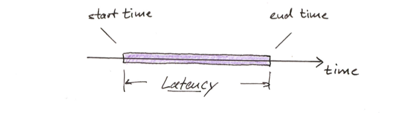
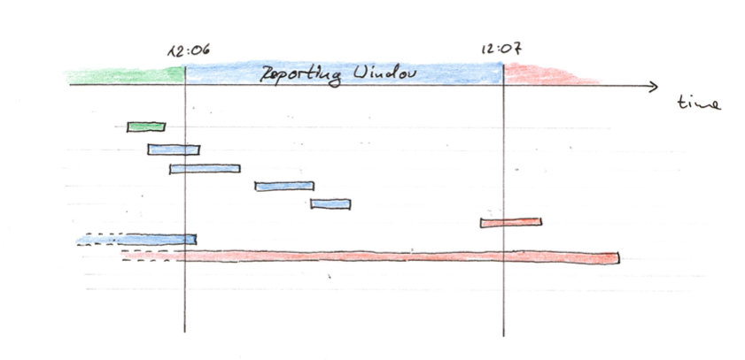
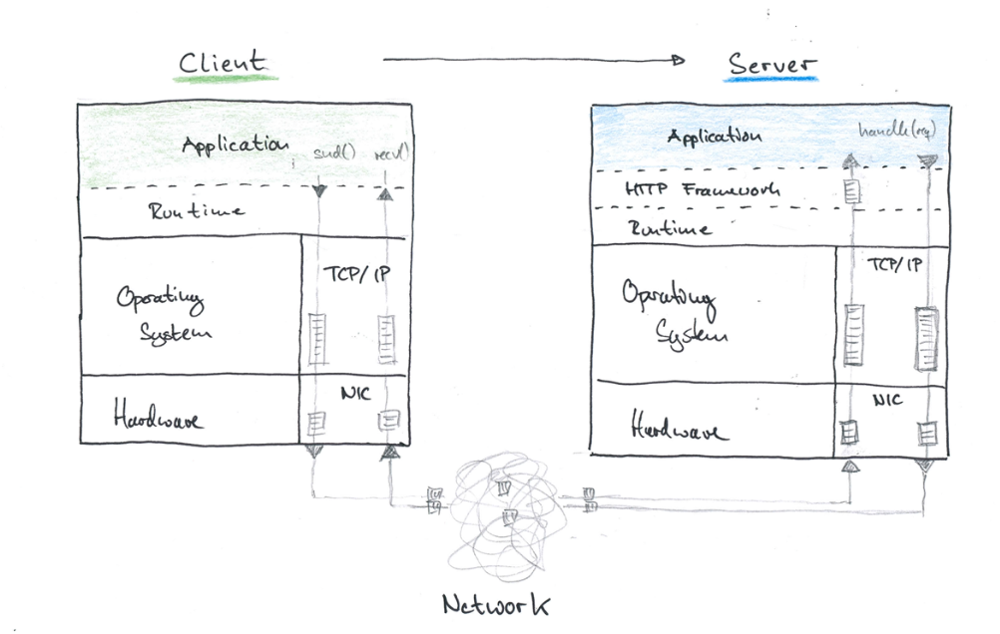

# How to Measure Latency?

## Instrumenting Code

<figure>
  
  <figcaption>A Latency Measurement</figcaption>
</figure>

Measuring Latency in code is relatively straight forward:

```python
t_start = time.now()
#
# code section you want to measure
#
latency = time.now() - t_start
```

Things to watch out for:

1. Capture early returns / exceptions. Use: `defer`,`try/catch/finally`.

2. Which clock is used?
   - What Resolution? sec / ms / usec / ns
   - Monotonic or affected by NTP resets?
   - What is measured? System Time, Process Time
   - Want: high resolution, monotonic, system time:
     - Java `System.nanoTime()`
     - C `clock_gettime(CLOCK_MONOTONIC,...)` / `gethrtime`
     - Python [`time.monotonic()`](https://www.python.org/dev/peps/pep-0418/)

3. Measurement Overhead. Checking the time costs time. Depending on
   implementation this can be 30ns - 300ns for the C-level call,
   plus function call overhead of the language runtime. (cf. [TS2016])
   Rule of thumb: **OK to measure latencies of 0.1ms or larger.** 


If you are taking more than three time measurements, it's likely a good idea to 
abstract the time measurement into an object or a decorator, that can be used as follows:
 
 ```python
 @timed
 def do_some_things():
    ...
 ```

Some tracing libraries (e.g. [OpenTelemetry](https://opentelemetry.io/)) provide
such decorators out-of-the box.

## Measuring Latency over Time

<figure>

<figcaption>Associating Latency Measurements with Reporting Windows</figcaption>
</figure>


When measuring latency over time, e.g. in a monitoring system, there are trickly
interactions of the collection window with the request duration that we are
capturing:

> Do we count processes that overlap the collection windows?

Best Practices:

- Count requests to the collection window when they were completed
- When shutting down the benchmark, wait for all requests to complete!

- Keep an eye on the active requests (metric)
- Capture max latency, if this is larger than collection window, we make serious mistakes.
- Option: count active requests with the elapsed duration at end-of-window. 

## Where to Measure Latency?

```
+--------+        +-----------+   +-----------+          +--------+ 
| Client | -----> | Intermedy | > | Intermedy | ------>  | Server |
+--------+        +-----------+   +-----------+          +--------+ 
```

This is the much trickier part!

We are most interested in measuring timings of request-reply interactions in
potentially distributed system (HTTP/gRPC API calls). The latency that the
client experiences is influenced by the whole chain of interactions.

Tradeoff:

- Measuring close to client is more meaningful but hard
- Measuring at server is easy but can be extermely misleading

Best: Measure Both -> Tracing.

## Hidden Queues

<figure>

<figcaption></figcaption>
</figure>


The computer systems we are working with have a lot of hidden queues in the HTTP
libraries, TCP/IP stack, NIC Cards, Network Gear, etc. this means that the
latency that the client experiences may be much worse, than what can be measured
on the server side.

It's very hard to observe those queues directly, we have to measure at the
client to make sure we capture the impacts of all of them.

## Response Time vs. Service Time

<figure>
   
   <figcaption>Response Time vs. Service Time Spans</figcaption>
</figure>

It's very easy to confuse response time with service time. 

- If you are measing latency at the server, you are measuring service time.
- Serice time behaves like response time when there is little traffic
- Service time can look completely fine even if your clients have bad experience.

The consequences of confusing service time with response time are quite drastic.

[Let's do some analysis...](../X1/)

## Coordinated Omission

In benchmarking applications there are are a surprising number of cases, where
the load generator coordinates with the system under test, and thereby skews
latency measurements. We call this phenomenon _Coordinated Ommission_.

Examples:

- Load is generated in loop like so:
  ```python
  while True:
      start = time.now()
      request.get("some.api/endpoint")
      record(time.now() - start)
  ```
  This logic backs-up as soon as the requests take longer. You are effectively
  measuring service-time of a single worker.
  
- When latency is dominated by GC activity (e.g. Java) and the load generator
  runs in the in the same process, it will be affected by GC pauses as well,
  and hence miss requests when the system is stalled. 

**Comment:** Gil Tenes original definition is more broad, and captures all cases
where one may confuse Repsonse time with Service time. IMHO, this definition
is overly broad, and can be distilled into more concise bits, like we do here.

## References

* [TS2016] Theo Schlossnagle -- Time, but Faster (ACM Queue - 2016)  
  <https://queue.acm.org/detail.cfm?id=3036398&doi=10.1145%2F3028687.3036398>


