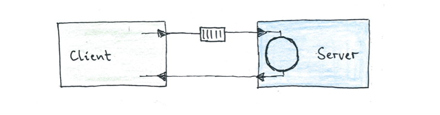
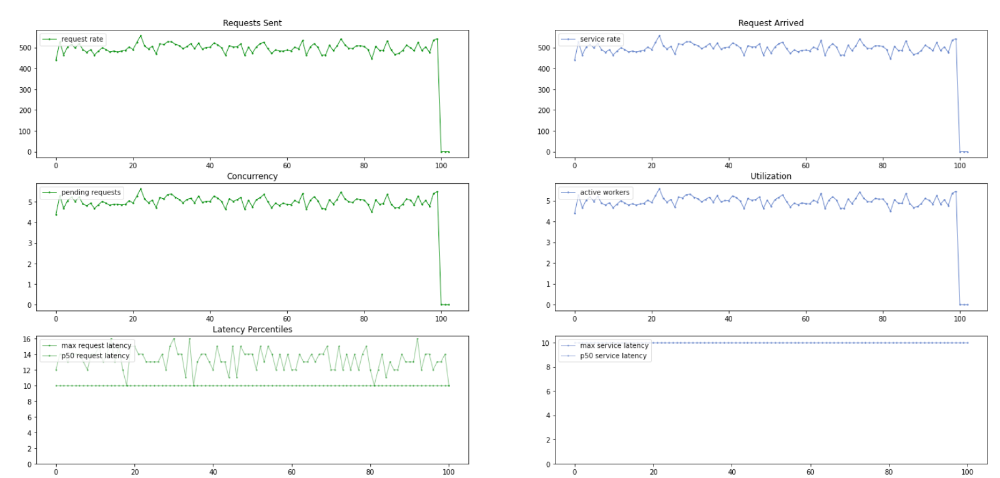
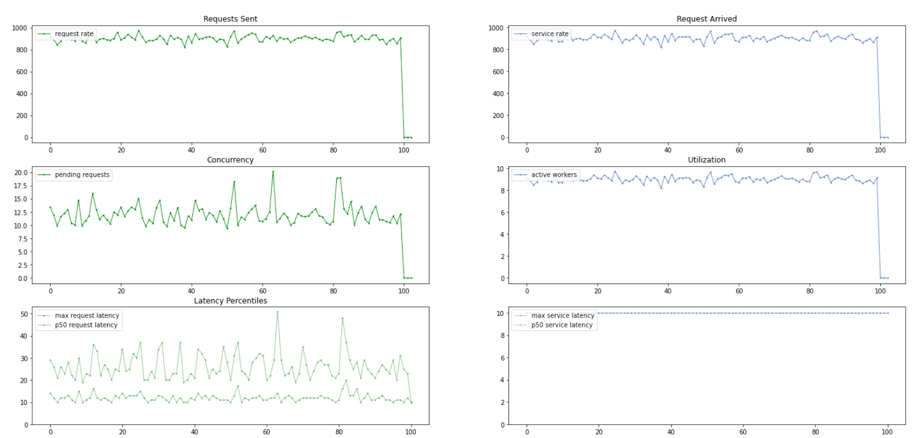
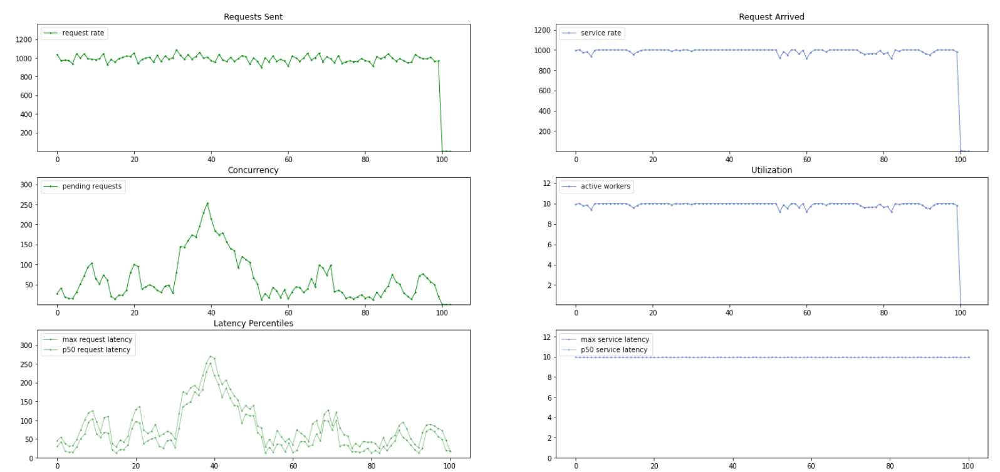
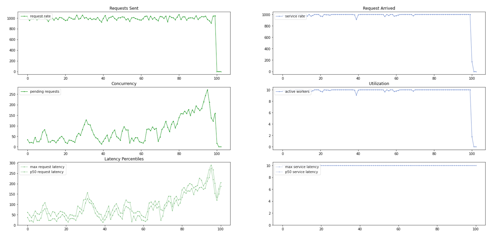
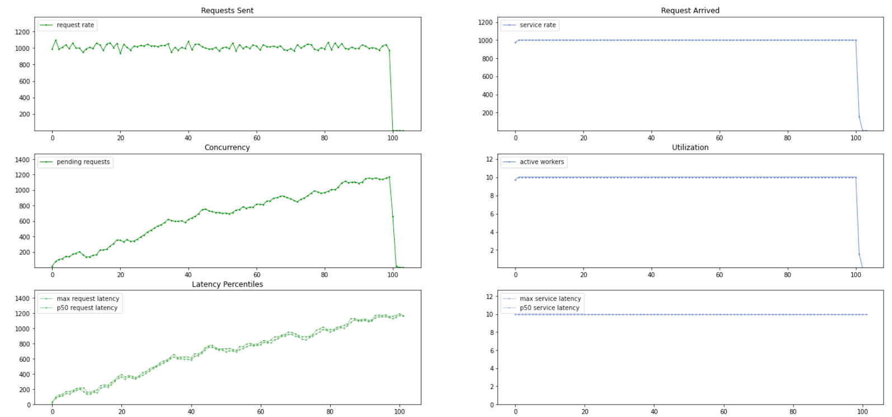
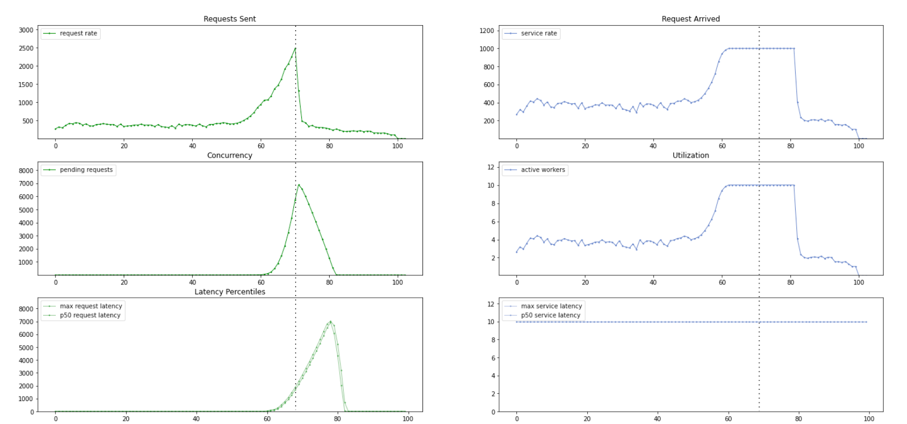
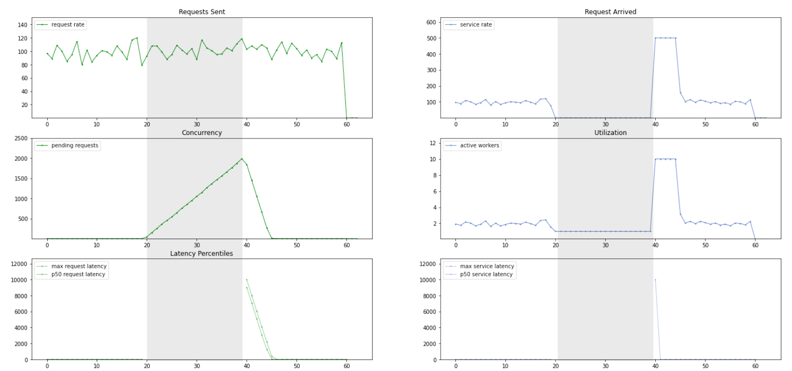

# Study - Simulating Queing Systems

We have seen that practical way to regard distributed systems is
as queuing systems with hidden queues.

<figure>

<figcaption>A practical queuing model, with hidden queues between Client and Server</figcaption>
</figure>

In this note, we are going to study the behavior by simulation.

## Setup

Simulate a Workload against a queuing system with N=10 workers and a constant service time of 10ms.
Hence we expect this system to be able to handle 1k requests per second.

We collect the following telemetry on client and server side:

| Metric Type | on Client           | on Server                            |
|-------------|---------------------|--------------------------------------|
| Requests    | Requests Sent       | Requests Arrived (at service worker) |
| Concurrency | Concurrent Requests | Active Workers                       |
| Latency     | Response Time       | Service Time                         |

- We don't capture information about the queue lenght, as most of our queues are hidden in practice.
- The service time is constant 10ms, so we expect this graph to be a flat line

## Queing System at 50% Load

<figure>

<figcaption></figcaption>
</figure>

- As long as we have enough free workers, all requests get immediately sergice
  and the concurrent requests are equal to the active workers.
- There are little queing delays the response time is nearly equal to the service time.

## Queing System at 90% load

<figure>

<figcaption></figcaption>
</figure>

- There are on averagte ~12 requests pending, while just under 10 workers are utilized.  
- We start seeing some queuing. Some requests have to wait double the time before getting serviced.

## Queuing Syste at 99% load

<figure>

<figcaption>... at 99% capacity</figcaption>
</figure>

- At 99% capacity the response times are dominated by queing. In some cases
  requests were waiting for 250ms before getting serviced (in 10ms).

## Queuing at the Edge

<figure>

<figcaption>... at 99% capacity</figcaption>
</figure>

## Queuing over the Edge

<figure>

<figcaption>... at 101% capacity</figcaption>
</figure>

## A Hockey Stick Curve

<figure>

<figcaption>... at 101% capacity</figcaption>
</figure>

## A Stalled System

<figure>

<figcaption>... at 101% capacity</figcaption>
</figure>
